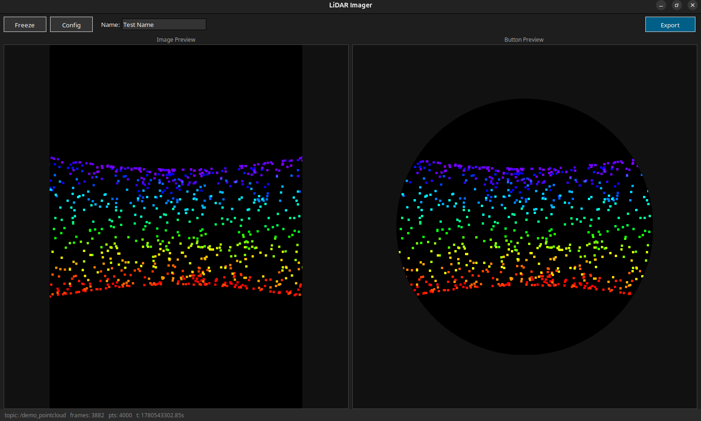
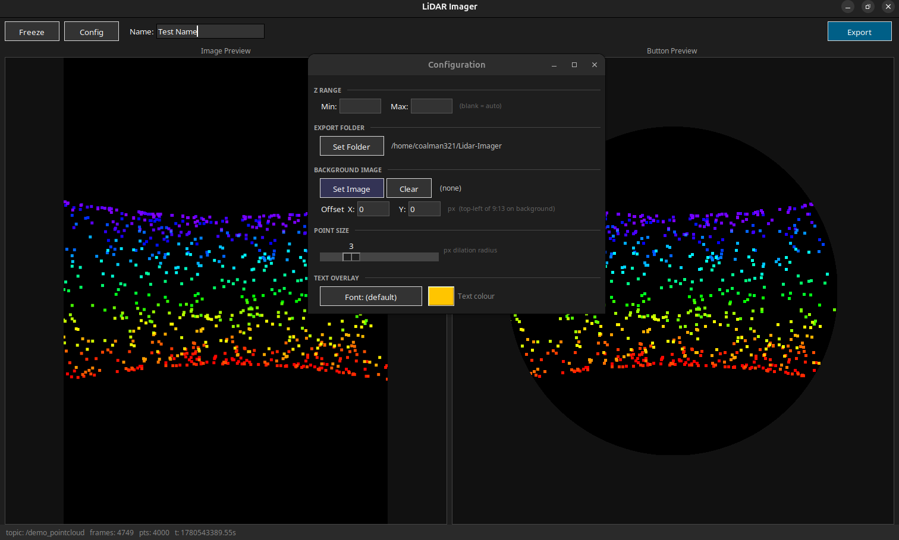

# Lidar-Imager
ROS2 lidar projection imager

## What is this tool?
This tool is designed to project 3D LiDAR point clouds onto a 2D image plane, creating a visual representation of the LiDAR data. It subscribes to a ROS2 topic that provides PointCloud2 messages, processes the point cloud data, and generates a PNG image.

The PNG Image is then exported as a PNG with a background image, or as a PDF with two circular crops. 
The circular crops are sized for creating a printed button, and the exported png can be printed on photo paper.

This tool was built as a fun demo of how robots understand the world around them, and how we can visualize that understanding. It is not intended for any specific use case, but rather as a demonstration of the capabilities of ROS2 and LiDAR data processing.

## Configuration

The tool is configured via the configure button in the UI. The options include:
- min and max Z for color mapping
- point size for the projected points
- background image for the PNG export
- location of the png export on the background image
- output directory for the exported images
- text font and color for the names in the pdf and png exports

